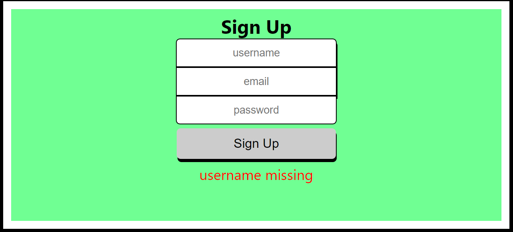

## `Producer App Server`

`Live App:` https://producer-app.vercel.app/

### `Routes`

### `/api/signup`

### `POST`
takes `username`, `email` and `password`.
verifies that password is between 8 and 72 characters and contains a capital letter and symbol.
verifies that username is not already taken.

### `/api/login`

### `POST`
takes `username` and `password` and checks if they are correct. If so it uses jsonwebtoken
to login with 30 minute timeout.

### `GET`
Uses jsonwebtoken to verify person is still logged in. If they are it returns the users
`username` and `lyrics`

### `/api/update`

### `POST`
Verifies person is still logged in. Takes `username` and `lyrics` and inserts/updates lyrics to users account

## `Technologies Used`

Express, Javascript, Node, Heroku

## Scripts

Start the application `npm start`

Start nodemon for the application `npm run dev`

Run the tests `npm test`

## Deploying

When your new project is ready for deployment, add a new Heroku application with `heroku create`. This will make a new git remote called "heroku" and you can then `npm run deploy` which will push to this remote's master branch.
